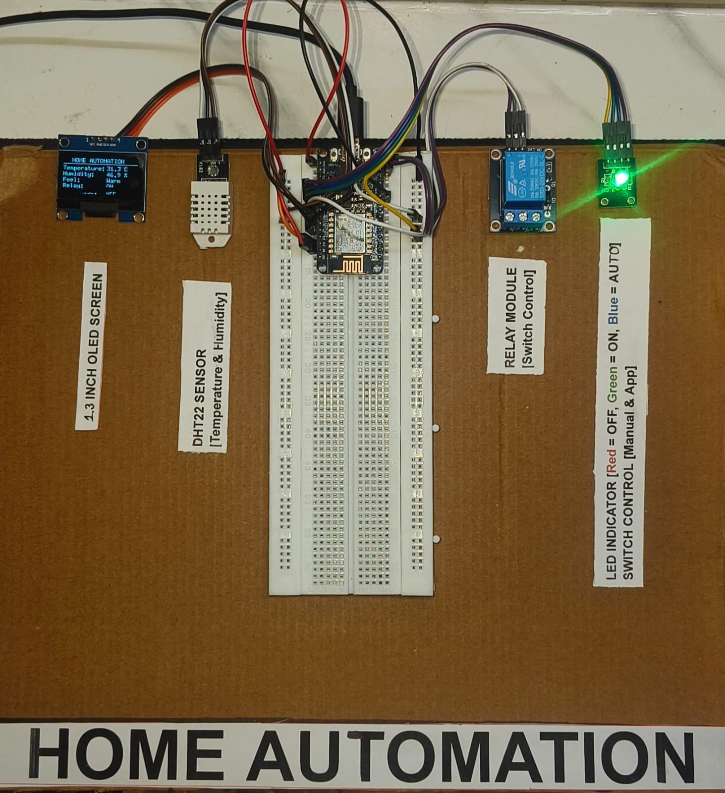
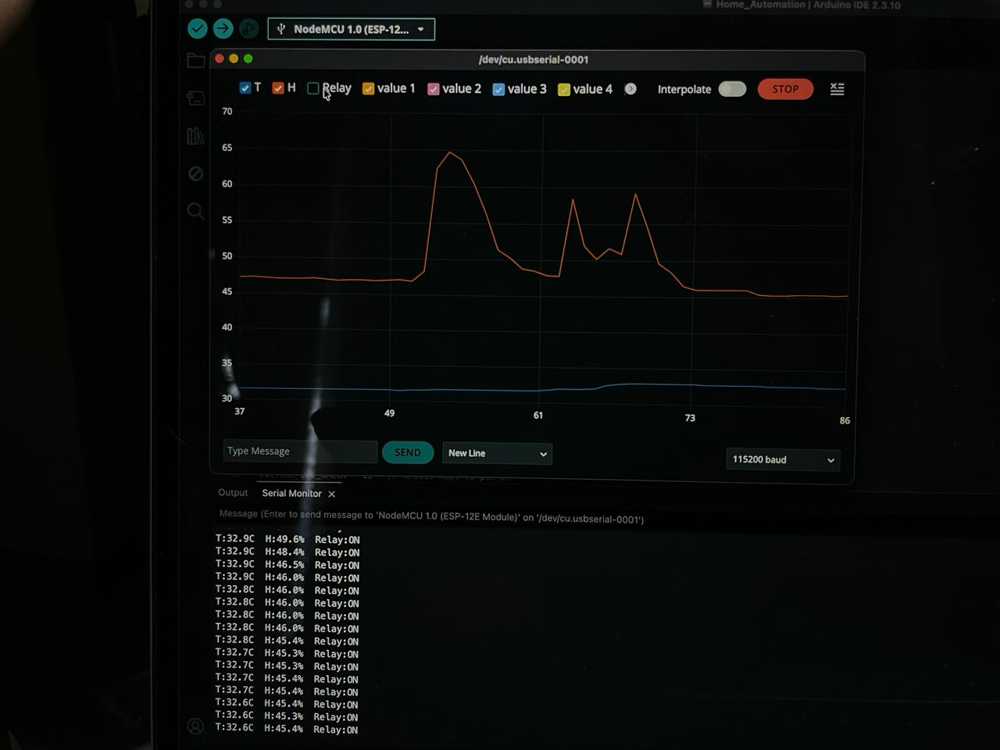
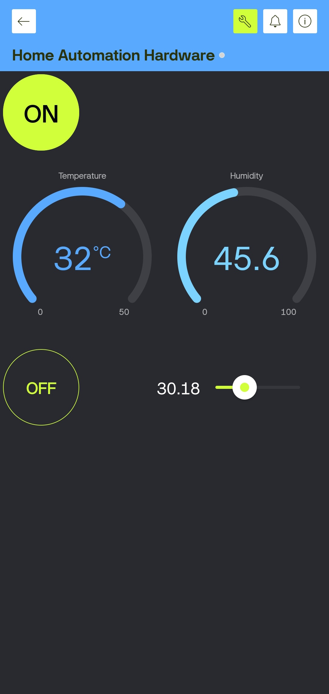

# IoT Home Automation System

NodeMCU ESP8266 + DHT22 + OLED + Relay + RGB LED + Blynk IoT

Built as part of Vaidsys Technologies Embedded Systems and IoT Internship June 2026

## Demo Board

## Live Sensor Graph

## Blynk App

## Features

- Remote appliance ON/OFF via Blynk mobile app
- Real-time temperature and humidity monitoring using DHT22
- Auto-control: appliance activates when temp exceeds threshold
- Live 1.3 inch OLED display showing sensor data and system status
- Color-coded RGB LED: Red=OFF, Green=ON, Blue=Auto, Yellow=Triggered

## Hardware Used

| Component | Purpose |
|---|---|
| NodeMCU ESP8266 | Main microcontroller and WiFi |
| DHT22 Sensor | Temperature and humidity |
| 1.3 inch SH1106 OLED | Real-time display |
| Relay Module 5V | Appliance switching |
| RGB LED Module | Visual status indicator |

## Pin Connections

| NodeMCU Pin | Connected To |
|---|---|
| D1 GPIO5 | OLED SCL |
| D2 GPIO4 | OLED SDA |
| D4 GPIO2 | DHT22 DATA |
| D5 GPIO14 | Relay IN |
| D6 GPIO12 | RGB Red |
| D7 GPIO13 | RGB Green |
| D8 GPIO15 | RGB Blue |
| 3V3 | DHT22 VCC and OLED VCC |
| Vin | Relay VCC |
| GND | All component GNDs |

## Blynk Virtual Pins

| Pin | Widget | Function |
|---|---|---|
| V0 | Button | Relay ON/OFF |
| V1 | Gauge | Temperature |
| V2 | Gauge | Humidity |
| V3 | Switch | Auto Mode |
| V4 | Slider | Temp Threshold |

## Libraries Required

- Blynk by Volodymyr Shymanskyy v1.3.2
- DHT sensor library by Adafruit
- U8g2 by oliver
- Adafruit Unified Sensor

## How To Use

1. Open Home_Automation.ino in Arduino IDE
2. Fill in your credentials at the top of the file
3. Install all required libraries
4. Select board NodeMCU 1.0 ESP-12E Module
5. Upload and open Serial Monitor at 115200 baud
6. Open Blynk app and control your appliances

## Internship Details

- Organization: Vaidsys Technologies
- Domain: Embedded Systems and IoT
- Duration: June 2026
- Type: Self-paced Work from Home
